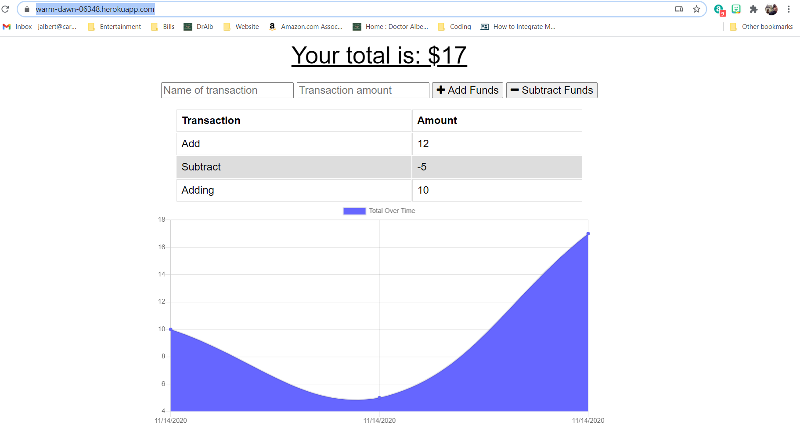

# Budget Tracker
## Table of Contents 
 * [About](#About) 
 * [Installation](#Installation) 
 * [Usage](#Usage) 
 * [Contributing](#Contributing) 
 * [License](#License) 
  
## About 
 In this project we provide a intuitional user inerface that allows the user to keep track of their budget.  The user will be able to add and subtract money from their current budget.  Then the program will display the user's budget over time using a chart.
  
## Installation 
 1. Clone this repository at [GitHub](https://github.com/jalbert12485/budget-tracker.git) 
```sh 
git clone https://github.com/jalbert12485/budget-tracker.git
 ``` 
2. Install packages using 
```sh 
npm i
 ``` 
 3. To run the server locally, you will then need to use 
 ```sh 
node server.js
 ``` 
 You will further need to set up your database and connect it to your work in the server.js file.  See [MongoDB](https://www.mongodb.com/) for more information on how to use a mongo database.
 
## Usage 
 In order to use this project as a user, you will go to the [deployed project](https://warm-dawn-06348.herokuapp.com/).  When there, you can new input a chnage to your budget giving it both a name and a value.  You can then add or subtract this value from your budget based on whether your input was a deposit or withdrawal.  Your budget, after each transaction, will then be displayed in the graph.  Note that, you can run this program even while offline.
 
## Contributing 
 If you would like to contribute to this package, please contact the author via [email](mailto:jalbert@carthage.edu).  Provide any details about your proposed chagnes so that your contribution can be made. 
## License 
 This is free and unencumbered software released into the public domain. Anyone is free to copy, modify, publish, use, compile, sell, or distribute this software, either in source code form or as a compiled binary, for any purpose, commercial or non-commercial, and by any means. 
 
 In jurisdictions that recognize copyright laws, the author or authors of this software dedicate any and all copyright interest in the software to the public domain. We make this dedication for the benefit of the public at large and to the detriment of our heirs and successors. We intend this dedication to be an overt act of relinquishment in perpetuity of all present and future rights to this software under copyright law. 
 
 THE SOFTWARE IS PROVIDED 'AS IS', WITHOUT WARRANTY OF ANY KIND, EXPRESS OR IMPLIED, INCLUDING BUT NOT LIMITED TO THE WARRANTIES OF MERCHANTABILITY, FITNESS FOR A PARTICULAR PURPOSE AND NONINFRINGEMENT. IN NO EVENT SHALL THE AUTHORS BE LIABLE FOR ANY CLAIM, DAMAGES OR OTHER LIABILITY, WHETHER IN AN ACTION OF CONTRACT, TORT OR OTHERWISE, ARISING FROM, OUT OF OR IN CONNECTION WITH THE SOFTWARE OR THE USE OR OTHER DEALINGS IN THE SOFTWARE. 
 
 For more information, please refer to <https://unlicense.org> 
